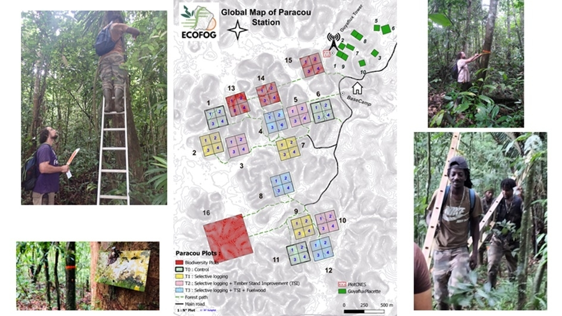
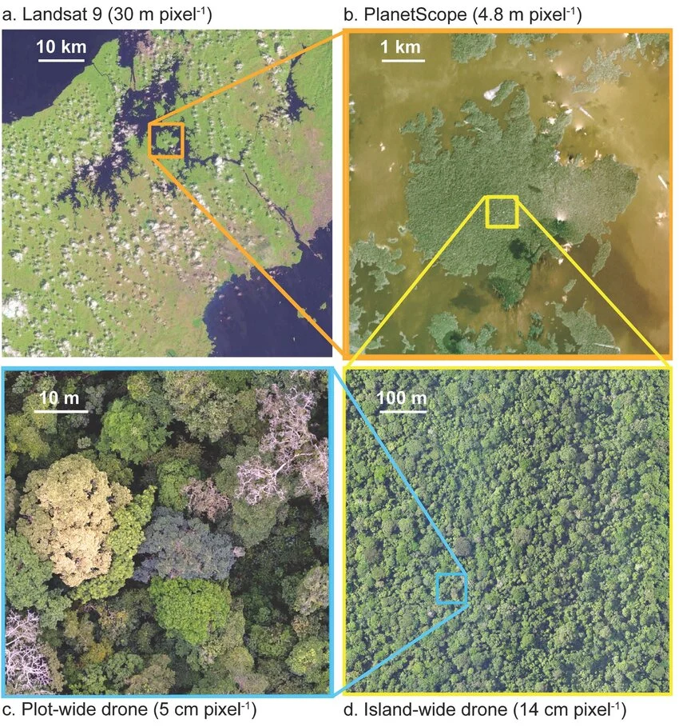

```{r}
#| label: Options
### Customized R options for this document
# Delete this chunk if you don't use R

# Necessary packages. Add all packages used in the code here.
packages_required <- c(
  # R tools, do not modify
  "knitr",
  # Add specific packages here
  "divent" ,
  "tidyverse", 
  "vegan"
)
# Already installed?
packages_installed <- vapply(
  packages_required, 
  FUN = requireNamespace, 
  FUN.VALUE = TRUE, 
  quietly = TRUE
) 
# Install missing packages
install.packages(names(packages_installed)[!packages_installed])

# Allow size='small' or any valid Latex font size in chunk options
def.chunk.hook <- knitr::knit_hooks$get("chunk")
knitr::knit_hooks$set(
  chunk = function(x, options) {
    x <- def.chunk.hook(x, options)
    ifelse(
      options$size == "normalsize", 
      yes = x,
      no = paste0("\n \\", options$size, "\n\n", x, "\n\n \\normalsize")
    )
  }
)

# knitr options (https://yihui.org/knitr/options/)
knitr::opts_chunk$set(
  # Code chunk automatic format if tidy is TRUE
  tidy = TRUE, 
  # Tidy code options: remove blank lines and cut lines after 50 characters
  tidy.opts = list(blank = FALSE, width.cutoff = 50),
  # Font size in PDF output
  size = "scriptsize", 
  # Select PDF figures in PDF output if PDF file exists beside PNG file
  knitr.graphics.auto_pdf = TRUE
)
# Text width of R functions output
options(width = 50)

# ggplot style
library("tidyverse")
# Function to call in each chunk that produces a figure
ggtheme_set <- function() {
  theme_set(theme_bw())
  theme_update(
    panel.background = element_rect(fill = "transparent", colour = NA),
    plot.background = element_rect(fill = "transparent", colour = NA)
  )
}
knitr::opts_chunk$set(dev.args = list(bg = "transparent"))

# Random seed
set.seed(973)
```

# Introduction

La diversité des forêts tropicales fascine les écologues en raison de son importance écologique et de la complexité des mécanismes qui la déterminent [@Gibson2011 ; @Wright2002b].
De nombreux modèles ont ainsi été développés pour tenter d’expliquer et de prédire les variations de diversité au sein de ces écosystèmes [@Liang2022].
Dans un contexte de menaces croissantes sur la biodiversité, mieux comprendre la diversité des forêts tropicales, y compris dans des sites largement étudiés, reste donc essentiel [@Fadrique2026].

La théorie biogéographie des îles propose que la richesse spécifique résulte d’un équilibre dynamique entre immigration et extinction, cette dernière étant notamment influencée par la taille des habitats \[@MacArthur1967\]. Dans cette perspective, la diversité d’une forêt peut également dépendre de son histoire et des perturbations qu’elle a subies. La forêt de BCI, notamment, est une forêt secondaire issue de perturbations passées \[@Raby2017\]. Sa diversité pourrait ainsi être favorisée par un niveau intermédiaire de perturbation, conformément à l’hypothèse de la perturbation intermédiaire proposée par Connell \[@Connell1978\].

# matériel et méthodes

## présentation du site de paracou

La station de Paracou, située près de Sinnamary, est une forêt tropicale humide de basse altitude caractérisée par un climat équatorial et une forte pluviométrie.
Elle comprend plusieurs parcelles suivies depuis plusieurs décennies par le CIRAD.

{fig-align="center"}

```{r}
#|label: paracou
library("tidyverse")
paracou6 <- read_csv2("data/Paracou6.csv")
```

## présentation du site de BCI

La station de Barro Colorado Island (BCI) se situe au Panama, dans une forêt tropicale humide à saison sèche marquée.
La parcelle forestière de 50 ha est suivie depuis 1980, avec un inventaire régulier des arbres.
Ce suivi à long terme permet d’étudier la diversité, la dynamique et la distribution spatiale des communautés végétales.



```{r}
#|label: vegan
library("vegan")
data(BCI)
# on aura besoin de BCI de 50 ha
library("divent")
BCI %>% 
  # Création d'un objet "abundances"
  as_abundances() %>% 
  # Les poids des parcelles sont égaux
  mutate(weight = 1) %>% 
  # Regrouper toutes les parcelles
  metacommunity() ->
  BCI_50ha
```

Dans le cadre de ce travail, l’analyse porte sur la comparaison de la diversité des communautés végétales de Paracou et de BCI (Barro Colorado Island).
Les analyses sont réalisées avec le logiciel RStudio.

# Resultats

Les profils de diversité de Hill ont étés calculés pour les deux forêts avec la fonction profile_hill().
Cette approche permet d’étudier la diversité pour différents ordres (q), depuis la richesse spécifique jusqu’à une diversité davantage influencée par les espèces abondantes.
500 simulations sont réalisées afin d’estimer l’incertitude autour des profils de diversité.

Les deux forêts sont distinguées par leur couleur et leur type de ligne, et les enveloppes de confiance permettent de comparer leurs profils de diversité selon l’ordre (q) tel que le présente la figure ci-dessous :

```{r}
paracou6 %>% 
  # Vecteur des noms d'espèce de chaque arbre
  pull(spName) %>% 
  # Création d'un objet "abundances"
  as_abundances() %>% 
  # Ajout des données de BCI
  bind_rows(BCI_50ha) %>% 
  # Remplacement des NA par 0
  mutate(across(everything(), ~ replace_na(.x, 0))) %>% 
  # Nom des sites
  mutate(site = c("Paracou", "BCI")) %>% 
  # Profil de diversité avec enveloppe de confiance
  profile_hill(n_simulations = 10) %>% 
  # Figure
  autoplot() +
  # Titre de la légende
  labs(color = "Forêt", linetype = "Forêt")
```

# Discussion

Les profils de diversité de Hill montrent que Paracou présente une diversité supérieure à BCI, avec une différence particulièrement importante pour (q=0), correspondant à la richesse spécifique.
Cela montre que Paracou possède un nombre d’espèces nettement plus élevé.
Cette forte diversité illustre la complexité des communautés des forêts tropicales, dont les mécanismes de maintien restent difficiles à expliquer [@Gibson2011; @Wright2002b].

Lorsque (q) augmente, l’écart entre les deux forêts diminue : les espèces rares ont alors moins d’influence et les espèces abondantes davantage.
Les deux communautés apparaissent donc plus proches lorsque l’on se concentre sur les espèces dominantes.
Ces différences peuvent être liées à différents processus écologiques, notamment ceux d’immigration et d’extinction décrits par la théorie de la biogéographie insulaire [@MacArthur1967].

BCI étant une forêt secondaire [@Raby2017], ses perturbations passées pourraient également avoir influencé sa diversité.
La théorie de la perturbation intermédiaire propose notamment qu’un niveau intermédiaire de perturbation puisse favoriser la coexistence des espèces [@Connell1978].
Cependant, notre comparaison entre seulement deux sites ne permet pas de tester directement cette hypothèse.
Ces résultats montrent ainsi l’intérêt d’étudier plusieurs composantes de la diversité pour mieux comprendre les forêts tropicales [@Liang2022].

# conclusion

La comparaison des profils de diversité de Hill met en évidence une diversité nettement plus élevée à Paracou qu’à BCI, principalement en termes de richesse spécifique.
Cette différence s’atténue lorsque l’importance accordée aux espèces abondantes augmente, suggérant que les deux forêts présentent des communautés plus proches en termes de structure des espèces dominantes.
Ces résultats soulignent ainsi l’importance de considérer plusieurs composantes de la diversité plutôt que la seule richesse spécifique pour comparer les communautés forestières tropicales.
